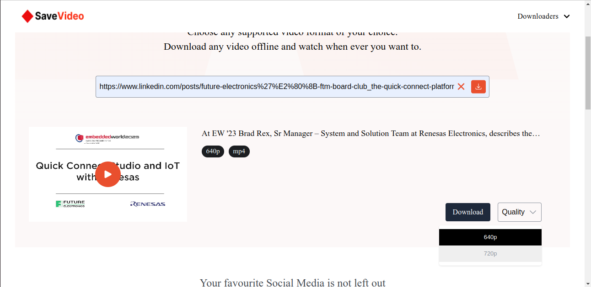
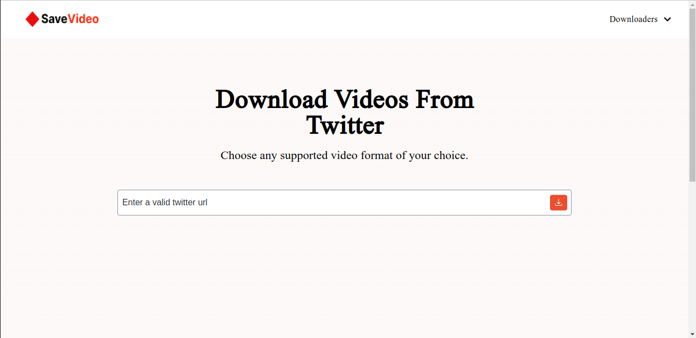

## Video Downloader

A web application for downloading videos from Social Media sites like Facebook, Twitter, LinkedIn and Youtube.

**Demo Link:** [https://video-downloader-theta.vercel.app/](https://video-downloader-theta.vercel.app/)


### Screenshots
**Homepage**


**Downloading Video**



**Specific Downloader Page**
    



### Features
- Download videos from multiple social media sites.
- Supports downloading multiple video qualities and formats whenever possible.
- Can play the extracted video directly on the website by clicking on the Play Icon.
- Supports downloading videos from specific video downloader pages like Linkedin Video Downloader for much faster downloads.
- Handles validation of different URLs with Regex preventing making http request for incorrect URLs resulting in a better performance.
- API Ratelimiting and retrying of failed http requests.


### Technologies used
- Next.js(React)
- Typescript
- CSS Modules
- Next.js API routes(Node.js)


### Setup / Installation
To run the project locally, follow the steps below:

1.  Clone the repo:

    ```
    bash git clone https://github.com/Chimise/video_downloader
    ```
2.  Install Dependencies
    
    ```
    bash npm install
    ```
3.  Create a .env.local file
    Checkout the [.env.example](./.env.example) file to see enviroment variables needed for development.

4.  Start the development server
    ```
    npm run build
    ```


### Approach:
The projects uses Object-oriented programming concepts. It uses Typescript abstract classes to add functionalities to extended classes.
The core video extraction logic is handled by two base classes, the Extractor class and the HTMLParser class. The HTMLParser adds functionality for extracting metadata from html strings on the server and the Extractor class provides functionality for validating the input url and extracting id from the url when possible as well as extracting video metadata.


